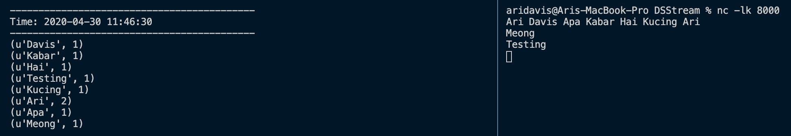

# DSStream

# Introduction
## Spark Streaming
**Spark Streaming** adalah sebuah ekstensi dari Spark API yang digunakan untuk menganalisa data secara real time dengan fitur scalable, high-throughput, fault-tolerant stream processing. Data bisa kita investigasi dari beberapa sumber seperti Kafka, Flume, Kinesis ataupun TCP sockets (yang kita contohkan di sini). Kita juga bisa melakukan algoritma yang kompleks di sini seperti map, reduce, join dan window.

# Penjelasan Codingan Streaming

## Import Library
Kita akan menggunakan library pyspark. Jika kalian belum memiliki library pyspark, silahkan install dengan menjalankan 
```
    pip install pyspark
```

Setelah itu kita akan mengimport beberapa modules dari pyspark

```
    from pyspark.sql import SparkSession
    from pyspark.streaming import StreamingContext
```

## Inisialisasi Context
Pertama sekali kita harus inisialisasi SparkContext terlebih dahulu.
```
    # local[2] menandakan kalau kita akan menggunakan 2 working thread
    sc = SparkContext("local[2]", "NamaAplikasi")
```

Setelah itu kita inisialisasi StreamingContext dengan parameter SparkContext dan interval waktu (sekon)
```
    ssc = StreamingContext(sc, 1)
```

Kita hubungkan StreamingContext kita ke koneksi TCP dengan port 9999
```
    lines = ssc.socketTextStream("localhost", 9999)
```

## Menerima Inputan dan Map Reduce
Cara map reduce adalah split semua kata dan mencari total dari setiap kata yang sama
```
    # Split berdasarkan spasi
    words = lines.flatMap(lambda line: line.split(" "))

    # Membuat tuple dari semua kata-katanya dengan pair 1, jadi setiap kata akan memiliki data seperti ini
    # ('Ari', 1)
    # ('Kata2', 1)
    # ('Ari', 1)
    pairs = words.map(lambda word: (word, 1))

    # Mentotal semua data yang sama sehingga outputnya akan menjadi
    # ('Ari', 2)
    # ('Kata2', 1)
    wordCounts = pairs.reduceByKey(lambda x, y: x + y)
```

## Print Data yang sudah di Map Reduce
```
    wordCount.pprint()
```
Di dalam pprint kita bisa memasukkan variable integer di mana itu akan menjadi berapa words yang akan di print


## Menjalankan Streaming
```
    ssc.start()
```

## Mencoba DSStream kita
Pertama sekali, jalankan terlebih dahulu script DSStream. Kemudian buka terminal baru dan jalankan
```
    nc -lk PORT_YANG_KITA_BUAT_STREAMNYA
```
Tinggal kalian ketikkan kata dan tekan enter.
Secara otomatis data kalian akan tampil di DSStream.




### Cara menggunakan DSStream.py punya saya
```
    # -h = Host
    # -p = Port
    # -i = Interval (sekon)
    python DSStream.py -h localhost -p 8000 -i 10
```